<div align="center">

# 🚪 Smart Door Access Control
### Hệ Thống Kiểm Soát Cửa Thông Minh

[](https://www.espressif.com/)
[](https://isocpp.org/)
[](https://www.arduino.cc/)
[](https://blynk.io/)

**Hệ thống kiểm soát ra vào 3 lớp bảo mật (RFID + Vân tay + Mật khẩu) với giám sát từ xa qua Blynk IoT.**

**A triple-layer security access control system (RFID + Fingerprint + PIN) with remote monitoring via Blynk IoT.**

</div>

---

## 📸 Demo

<!-- 
🔽 THÊM HÌNH ẢNH / VIDEO DEMO TẠI ĐÂY 🔽
Ví dụ:


-->

> ⚠️ *Vui lòng thêm ảnh/video demo thiết bị phần cứng tại đây.*
>
> ⚠️ *Please add hardware demo images/videos here.*

---

## 📐 System Architecture / Kiến Trúc Hệ Thống

```mermaid
graph LR
    subgraph INPUT ["🔐 Authentication Layer"]
        RFID[RFID Card<br/>MFRC522]
        FP[Fingerprint<br/>R307]
        KP[Keypad<br/>TTP229]
    end

    subgraph MCU ["⚙️ Processing Unit"]
        ESP32[ESP32<br/>WROOM-32]
        EEPROM[(EEPROM<br/>Cards + Password)]
    end

    subgraph OUTPUT ["🔔 Output Layer"]
        LCD[LCD 20x4<br/>I2C]
        RELAY[Relay<br/>Solenoid Lock]
        BUZZER[Buzzer]
        LED_S[LED Success]
        LED_F[LED Failed]
    end

    subgraph CLOUD ["☁️ Cloud & Remote"]
        BLYNK[Blynk Cloud]
        APP[📱 Mobile App]
    end

    RFID -->|SPI| ESP32
    FP -->|UART| ESP32
    KP -->|Digital| ESP32
    ESP32 --> LCD
    ESP32 --> RELAY
    ESP32 --> BUZZER
    ESP32 --> LED_S
    ESP32 --> LED_F
    ESP32 <-->|WiFi| BLYNK
    BLYNK <--> APP

    style INPUT fill:#4CAF50,color:#fff
    style MCU fill:#2196F3,color:#fff
    style OUTPUT fill:#FF9800,color:#fff
    style CLOUD fill:#9C27B0,color:#fff
```



---

## 🛠️ Tech Stack / Công Nghệ

| Layer | Technology |
|-------|-----------|
| **MCU** |  |
| **Language** |   |
| **IDE** |  |
| **RFID** |  |
| **Fingerprint** |  |
| **Keypad** |  |
| **Display** |  |
| **IoT Platform** |  |

---

## ⚡ Key Features & Metrics / Tính Năng & Chỉ Số

| Feature | Metric |
|---------|--------|
| 🔐 **Xác thực 3 lớp** / Triple-layer Auth | RFID (MFRC522, SPI 13.56MHz) + Fingerprint (R307, UART 57600bps) + PIN (TTP229 Keypad) |
| 📇 **Quản lý thẻ RFID** / RFID Management | Lưu tối đa **20 thẻ** trong EEPROM (4 bytes/UID, addr `0x000`) |
| 🖐️ **Quản lý vân tay** / Fingerprint Storage | Lưu tối đa **20 mẫu vân tay** (addr `0x300`, R307 onboard flash) |
| 🔑 **Mật khẩu** / Password | Lưu trong EEPROM (addr `0x400`), thay đổi qua keypad |
| ⏱️ **Thời gian phản hồi** / Response Time | < **500ms** từ quét → mở khóa |
| 📱 **Giám sát từ xa** / Remote Monitoring | Real-time qua **Blynk IoT** (WiFi 2.4GHz) |
| 🖥️ **Hiển thị trạng thái** / Status Display | LCD 20x4 I2C hiển thị trạng thái, hướng dẫn, kết quả xác thực |
| 🔔 **Cảnh báo** / Alerts | Buzzer + LED (xanh: thành công, đỏ: thất bại) |
| 🏗️ **Kiến trúc mã** / Code Architecture | Modular OOP — 8 module riêng biệt (Manager pattern) |

---

## 🔌 Hardware Setup / Sơ Đồ Đấu Nối

### Pinout Table / Bảng Nối Chân

| Component | Pin / Signal | ESP32 GPIO |
|-----------|-------------|------------|
| **MFRC522 (RFID)** | SDA (SS) | `GPIO 5` |
| | RST | `GPIO 27` |
| | MOSI | `GPIO 23` (default SPI) |
| | MISO | `GPIO 19` (default SPI) |
| | SCK | `GPIO 18` (default SPI) |
| **R307 (Fingerprint)** | TX | `GPIO 16` (RX2) |
| | RX | `GPIO 17` (TX2) |
| **TTP229 (Keypad)** | SCL | `GPIO 32` |
| | SDO | `GPIO 33` |
| **LCD 20x4** | SDA | `GPIO 21` (default I2C) |
| | SCL | `GPIO 22` (default I2C) |
| | I2C Address | `0x27` |
| **Relay / Lock** | IN | `GPIO 4` |
| **Buzzer** | Signal | `GPIO 25` |
| **LED Failed** | Anode | `GPIO 15` |

> 💡 **Note:** LED Success và Relay dùng chung `GPIO 4` — khi mở khóa, LED xanh sáng đồng thời.

---

## 🚀 How to Run / Hướng Dẫn Chạy

### 1. Hardware / Phần cứng
```
Linh kiện cần chuẩn bị:
• ESP32 WROOM-32 DevKit
• MFRC522 RFID Module + thẻ RFID 13.56MHz
• R307 Fingerprint Sensor
• TTP229 16-key Capacitive Keypad
• LCD 20x4 I2C (addr 0x27)
• Relay Module 5V + Solenoid Lock 12V
• Buzzer, LED xanh, LED đỏ
• Nguồn 5V/12V
```

### 2. Software / Phần mềm
```bash
# Clone repository
git clone https://github.com/duc2512/Smart-Door-Access-Control.git

# Mở bằng Arduino IDE
# Open with Arduino IDE

# Cài đặt thư viện / Install libraries:
# - MFRC522 (by GithubCommunity)
# - Adafruit Fingerprint Sensor Library
# - LiquidCrystal_I2C
# - Blynk (by Volodymyr Shymanskyy)
# - EEPROM (built-in)
```

### 3. Cấu hình / Configuration
Chỉnh sửa file `Config.h`:
```cpp
// WiFi
const char* ssid = "YOUR_WIFI_SSID";
const char* password = "YOUR_WIFI_PASSWORD";

// Blynk
#define BLYNK_AUTH_TOKEN "YOUR_BLYNK_AUTH_TOKEN"
```

### 4. Upload
```
Board: ESP32 Dev Module
Upload Speed: 921600
Flash Frequency: 80MHz
```

---

## 📁 Project Structure / Cấu Trúc Dự Án

```
Smart-Door-Access-Control/
├── SmartDoor.ino          # 🚀 Main entry point
├── Config.h               # ⚙️ Pin definitions & constants
├── SystemState.h          # 📊 State machine (IDLE, AUTH, ADMIN...)
├── RFIDManager.cpp/h      # 📇 RFID card management (MFRC522)
├── FingerprintManager.cpp/h # 🖐️ Fingerprint enrollment & matching
├── InputManager.cpp/h     # ⌨️ Keypad input (TTP229) & password
├── DisplayManager.cpp/h   # 🖥️ LCD 20x4 display logic
├── DoorController.cpp/h   # 🚪 Relay, buzzer, LED control
├── NetworkManager.cpp/h   # 🌐 WiFi & Blynk IoT connection
└── StorageManager.cpp/h   # 💾 EEPROM read/write (cards, password)
```

---

## 👤 Author

**Le Tho Duc** — [GitHub @duc2512](https://github.com/duc2512)

---

<div align="center">
⭐ If you find this project useful, please give it a star! ⭐
</div>
